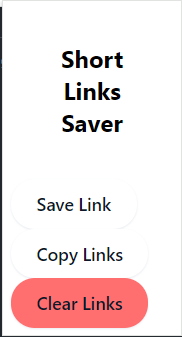

# Shorts Links Copy Extension

## Screenshot:



## Overview
Shorts Links Copy Extension is a Chrome extension designed to simplify the process of copying YouTube Shorts links. With a single click, you can copy the URL of the current YouTube Shorts video to your clipboard, making it easier to share with others.

## Features
- Copy YouTube Shorts links with one click.
- Lightweight and easy to use.
- No additional permissions required.

## Installation
1. Clone the repository: 
   ```sh
   git clone https://github.com/milliyin/Shorts-Links-Copy-Extension.git
   ```
2. Open Chrome and navigate to `chrome://extensions/`.
3. Enable "Developer mode" in the top right corner.
4. Click "Load unpacked" and select the cloned repository folder.

## Usage
1. Navigate to a YouTube Shorts video.
2. Click on the extension icon in the Chrome toolbar.
3. The link is now copied to your clipboard.

## Files
- `background.js`: Handles background tasks for the extension.
- `manifest.json`: Defines the extension’s configuration and permissions.
- `popup.html`: The HTML for the extension's popup interface.
- `popup.js`: JavaScript for handling user interactions in the popup.
- `style.css`: Styles for the popup interface.
- `icon.png`: Icon for the extension.

## Contributing
Feel free to submit issues or pull requests if you find any bugs or have improvements.

## License
This project is licensed under the MIT License.
